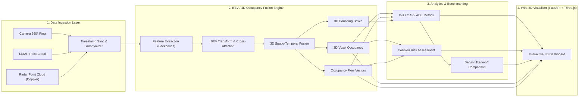

# TÀI LIỆU YÊU CẦU SẢN PHẨM (PRODUCT REQUIREMENTS DOCUMENT - PRD)
## DỰ ÁN: LAB HUẤN LUYỆN VÀ TRỰC QUAN HÓA MÔ HÌNH BEV/4D OCCUPANCY FUSION CHO VINFAST ADAS
**Mã dự án:** RAV-25  
**Phiên bản:** 1.0  
**Thời gian thực hiện:** 6 tuần (Sprints: 6 x 1 tuần)  
**Tác giả:** Đội ngũ Kỹ thuật ADAS & AI Perception  
**Trạng thái:** Bản thảo phê duyệt (Draft for Review)  

---

## 1. TỔNG QUAN SẢN PHẨM (EXECUTIVE SUMMARY)

### 1.1. Tuyên bố bài toán
Hệ thống trợ lái nâng cao (ADAS) và xe tự hành cấp độ cao (L2+ / L3) khi vận hành trong đô thị đông đúc cần nhận thức chuẩn xác và toàn diện không gian 3D động xung quanh xe trong mọi điều kiện:
- Phương tiện lấn làn, góc khuất tầm nhìn, vật thể bị che khuất (occlusion).
- Chướng ngại vật dị hình không thuộc danh mục định nghĩa trước (cành cây rơi, thùng carton, vũng nước, cọc rào thi công).
- Hướng và tốc độ chuyển động tức thời của vật thể để dự báo va chạm.

Phương pháp truyền thống chỉ nhận diện Hộp bao 3D (3D Bounding Box) đơn lẻ từ Camera hoặc LiDAR thường xuyên gặp hiện tượng bỏ sót vật thể lạ, thiếu thông tin về không gian trống/chiếm dụng (free/occupied space) và gặp khó khăn khi cảm biến đơn lẻ bị suy giảm chất lượng (trời mưa, sương mù, ngược sáng).

### 1.2. Giải pháp sản phẩm
Dự án **RAV-25** phát triển một **Nền tảng Thử nghiệm & Trực quan hóa (Benchmarking & Visualization Lab)** cho mô hình **BEV (Bird's Eye View) kết hợp 4D Occupancy Grid & Occupancy Flow**, dung hợp dữ liệu từ bộ 3 cảm biến: **Camera - LiDAR - Radar**.

Sản phẩm cho phép:
1. Huấn luyện/Chạy suy luận mô hình BEV + Occupancy thời gian thực/gần thời gian thực.
2. Sinh bản đồ chiếm dụng 3D theo thời gian (4D Occupancy Grid) và trường vector chuyển động (Occupancy Flow).
3. Đánh dấu và cảnh báo vùng nguy cơ va chạm trong tương lai gần.
4. Cung cấp giao diện Web 3D trực quan giúp kỹ sư ADAS VinFast đối chiếu, so sánh hiệu năng của nhiều cấu hình cảm biến (Camera-only vs Camera+Radar vs Camera+LiDAR vs Tri-modal).

---

## 2. MỤC TIÊU DỰ ÁN (GOALS & NON-GOALS)

### 2.1. Mục tiêu cốt lõi (Goals)
- **G-1 (Perception Accuracy):** Đạt IoU Voxel Occupancy $\ge 40\%$ (kỳ vọng $\ge 50\%$) và mAP 3D Object Detection $\ge 55\%$ trên tập kiểm thử chuẩn (nuScenes/Waymo).
- **G-2 (4D Flow Dynamics):** Ước lượng trường vận tốc occupancy với sai số chuyển động trung bình $ADE \le 0.8\text{m}$, $FDE \le 1.5\text{m}$.
- **G-3 (Benchmarking Matrix):** Cho phép so sánh song song trực tiếp (A/B testing) ít nhất 3 cấu hình sensor fusion về độ chính xác, tỷ lệ False Positive/False Negative, độ trễ và chi phí GPU.
- **G-4 (Interactive Web Lab):** Cung cấp công cụ Web tương tác 3D mượt mà (Three.js/WebGL $\ge 30\text{ fps}$) để kỹ sư kiểm tra từng frame, xoay lật góc nhìn và tua thời gian.
- **G-5 (Privacy & Anonymization):** Đảm bảo tự động xóa mờ (blur) khuôn mặt và biển số xe trên mọi video camera hiển thị trên giao diện người dùng.

### 2.2. Giới hạn ngoài phạm vi (Non-Goals)
- **NG-1:** Không kết nối điều khiển trực tiếp hệ thống bẻ lái/phanh xe thật (không tích hợp CAN bus / Drive-by-wire).
- **NG-2:** Không thương mại hóa thành phần cứng nhúng ASIL-D trên chip xe hơi trong giai đoạn 6 tuần (mục tiêu là nền tảng Lab phân tích & ra quyết định kiến trúc).
- **NG-3:** Không phát triển module điều khiển xe tự động hoàn chỉnh (chỉ tập trung vào tầng Perception & Risk Zone Estimation phục vụ đầu vào cho Planning).

---

## 3. CHÂN DUNG NGƯỜI DÙNG MỤC TIÊU (USER PERSONAS)

### Persona 1: ADAS Perception & Deep Learning Engineer
- **Nhu cầu:** Cần môi trường thực nghiệm để huấn luyện, tinh chỉnh và kiểm tra độ chính xác của các kiến trúc mạng mới (BEVFusion, BEVFormer, OccNet); xem trực quan các trường hợp mô hình đoán sai (False Positive / False Negative).
- **Điểm đau (Pain point):** Khó hình dung kết quả dạng tensor 3D/4D nếu chỉ nhìn vào các con số loss/metric tổng thể; thiếu công cụ đối soát đồng bộ đa cảm biến.

### Persona 2: Sensor Architecture & System Hardware Lead
- **Nhu cầu:** Cần dữ liệu thực nghiệm để quyết định cấu hình cảm biến tối ưu cho các dòng xe VinFast (VF6, VF7, VF8, VF9...): Có nên bỏ bớt LiDAR để giảm giá thành? Radar 4D có bù đắp được cho Camera trong điều kiện thời tiết xấu không?
- **Điểm đau:** Thiếu báo cáo định lượng đối đầu (Trade-off Matrix) giữa chất lượng nhận thức (IoU/mAP) và chi phí phần cứng / điện năng tính toán GPU.

### Persona 3: Autonomous Driving Motion Planning Engineer
- **Nhu cầu:** Cần bản đồ không gian trống (free-space) và trường vector dòng chảy (Occupancy Flow) tin cậy để thiết lập hành lang an toàn cho thuật toán lập quỹ đạo xe (Trajectory Planner).

---

## 4. QUY TẮC VẬN HÀNH & RÀNG BUỘC KỸ THUẬT (SYSTEM CONSTRAINTS)

1. **Nguyên tắc Human-in-the-loop:** Hệ thống là công cụ phân tích và mô phỏng. Kỹ sư chịu trách nhiệm kiểm duyệt và đánh giá chất lượng mô hình trước khi bàn giao trọng số cho các bộ phận hạ nguồn.
2. **Ràng buộc an toàn dữ liệu:** Dữ liệu hình ảnh camera trước khi đẩy lên trình duyệt người dùng phải đi qua module anonymizer (tự động blur biển số và khuôn mặt).
3. **Môi trường triển khai:** Chạy hoàn chỉnh dưới dạng containerized (Docker Compose + NVIDIA GPU Driver), sẵn sàng triển khai trên hạ tầng On-premise hoặc Cloud GPU Lab.

---

## 5. YÊU CẦU CHỨC NĂNG CHI TIẾT (FUNCTIONAL REQUIREMENTS)



### 5.1. Module Ingestion & Preprocessing (FR-1)
- **FR-1.1:** Hỗ trợ đọc và phân tích cấu trúc dữ liệu chuẩn công nghiệp xe tự hành: **nuScenes**, **Waymo Open Dataset**, **KITTI Raw**.
- **FR-1.2 (Đồng bộ cảm biến):** Đồng bộ hóa nhãn thời gian (timestamp synchronization) giữa 6-8 camera quanh xe, 1-3 LiDAR chùm tia (32/64/128 rays) và radar phía trước/quanh xe (vận tốc Doppler).
- **FR-1.3 (Hiệu chuẩn không gian - Extrinsics/Intrinsics):** Ánh xạ tọa độ từ hệ quy chiếu từng cảm biến về hệ quy chiếu thân xe (Ego-Vehicle Coordinate System).
- **FR-1.4 (Radar Processing):** Bộ lọc lọc nhiễu điểm radar, trích xuất thuộc tính vị trí $(x, y, z)$, biên độ phản xạ (RCS), và vận tốc hướng tâm bù trừ chuyển động tự thân của xe (compensated Doppler velocity).
- **FR-1.5 (Ẩn danh dữ liệu):** Tích hợp model phát hiện nhanh (YOLO/Face-Plate detector) để tự động làm mờ khuôn mặt và biển số xe trước khi render ra frontend.

### 5.2. Mô hình BEV & 4D Occupancy Engine (FR-2)
- **FR-2.1 (BEV Feature Extractor):** Triển khai kiến trúc trích xuất đặc trưng đa góc nhìn chuyển đổi về mặt phẳng BEV (sử dụng LSS - Lift-Splat-Shoot hoặc Cross-Attention phong cách BEVFormer/BEVFusion).
- **FR-2.2 (3D Voxel Occupancy Grid):** Dự đoán trạng thái của từng voxel trong không gian kích thước tiêu chuẩn:
  - Phạm vi: $X \in [-50\text{m}, 50\text{m}]$, $Y \in [-50\text{m}, 50\text{m}]$, $Z \in [-5\text{m}, 3\text{m}]$.
  - Kích thước voxel: $0.4\text{m} \times 0.4\text{m} \times 0.4\text{m}$ (hoặc tùy biến $0.2\text{m}$).
  - Trạng thái: Trống (Free), Bị chiếm dụng (Occupied) kèm nhãn ngữ nghĩa (Xe, Người, Mặt đường, Chướng ngại tĩnh, Chướng ngại không xác định).
- **FR-2.3 (Occupancy Flow & Dự báo chuyển động 4D):**
  - Ước lượng vector vận tốc 3 chiều $(v_x, v_y, v_z)$ cho từng voxel bị chiếm dụng trong thời gian thực.
  - Dự báo vị trí chuyển dịch của các voxel trong các khoảng thời gian tương lai: $t + 0.5\text{s}$, $t + 1.0\text{s}$, $t + 2.0\text{s}$.
- **FR-2.4 (Collision Risk Zone Indicator):**
  - Tính toán vùng giao cắt giữa hướng chuyển động của xe tự hành (Ego trajectory) và các voxel có vector dòng chảy hướng về phía xe.
  - Phân loại 3 mức cảnh báo: An toàn (Xanh), Chú ý (Vàng), Nguy cơ va chạm cao (Đỏ).

### 5.3. Module So sánh & Đánh giá Cấu hình Cảm biến (FR-3)
- **FR-3.1:** Hỗ trợ kích hoạt/vô hiệu hóa các nhánh cảm biến đầu vào theo 4 kịch bản cố định:
  1. *Config A:* Camera-only (6 cameras)
  2. *Config B:* Camera + Radar (Front & Corner Radars)
  3. *Config C:* Camera + LiDAR (LiDAR 32/64 chùm)
  4. *Config D:* Tri-modal Fusion (Camera + LiDAR + Radar)
- **FR-3.2 (Metric Dashboard):** Tính toán và hiển thị tự động:
  - **Voxel IoU (Intersection over Union):** Đánh giá độ phủ hình học và ngữ nghĩa.
  - **3D Detection mAP:** Theo chuẩn nuScenes detection score (NDS / mAP).
  - **Occupancy Flow Error:** Average Displacement Error (ADE) & Final Displacement Error (FDE).
  - **Inference Latency:** Thời gian chạy từng giai đoạn (Backbone, Fusion Neck, Head) tính theo milliseconds (ms).
  - **Tài nguyên GPU:** GPU VRAM Usage (GB), GPU Utilization (%), ước lượng chi phí tính toán phần cứng.
- **FR-3.3 (Lọc & Phân tích lỗi):**
  - Bộ lọc phân tích theo điều kiện ngoại cảnh: Ban ngày, Ban đêm, Trời mưa, Mật độ phương tiện cao.
  - Trực quan hóa các voxel bị dự đoán sai: Dương tính giả (False Positive) và Âm tính giả (False Negative).

### 5.4. Ứng dụng Web Dashboard & Trực quan hóa 3D (FR-4)
- **FR-4.1 (Giao diện 3D WebGL / Three.js):**
  - Render không gian 3D tương tác: Xoay 360°, phóng to/thu nhỏ, đổi góc nhìn (Top-down BEV, Follow-cam góc nhìn thứ ba của xe, Free-roam camera).
  - Render point cloud LiDAR (màu sắc theo độ cao hoặc cường độ phản xạ).
  - Render lưới 3D Voxel với màu sắc tương ứng theo lớp ngữ nghĩa (Semantic labels) và thanh trượt ngưỡng tin cậy (Confidence threshold slider).
  - Render mũi tên vector chuyển động (Flow arrows) trực quan.
- **FR-4.2 (Giao diện Đồng bộ Đa phương tiện):**
  - Hiển thị dải video các camera xung quanh xe (đã làm mờ thông tin cá nhân).
  - Thanh tua dòng thời gian (Playback Timeline & Scrubber): Play, Pause, Next Frame, Previous Frame, tua theo mốc giây.
- **FR-4.3 (Chế độ So sánh Song song - Dual View Mode):**
  - Cho phép chia đôi màn hình (Split Screen) để so sánh trực tiếp Config 1 (ví dụ: Camera-only) đối đầu Config 2 (ví dụ: Camera+Radar) trên cùng một frame dữ liệu.

---

## 6. YÊU CẦU PHI CHỨC NĂNG (NON-FUNCTIONAL REQUIREMENTS)

| Mã NFR | Hạng mục | Tiêu chuẩn kỹ thuật |
| :--- | :--- | :--- |
| **NFR-1** | **Tốc độ hiển thị Web** | Trực quan hóa WebGL/Three.js đạt tối thiểu 30 FPS (kỳ vọng 60 FPS) với tập dữ liệu chứa tới $100.000$ voxels/points đồng thời. |
| **NFR-2** | **Độ trễ API Backend** | Endpoint FastAPI trả về dữ liệu nén (Protocol Buffers hoặc nén nhị phân / gzip JSON) dưới 150ms cho mỗi frame hoàn chỉnh. |
| **NFR-3** | **Đóng gói & Khả chuyển** | Triển khai 1-click thông qua Docker Compose (bao gồm NVIDIA Container Toolkit hỗ trợ GPU Passthrough). |
| **NFR-4** | **Bảo mật & Ẩn danh** | $100\%$ dữ liệu hình ảnh khuôn mặt và biển số xe được che phủ trước khi truyền tải qua WebSocket/HTTP tới trình duyệt client. |
| **NFR-5** | **Khả năng mở rộng (Extensibility)** | Kiến trúc module hóa tách biệt: Model Inferencer, Data Loader, Metric Calculator và Web Visualizer để dễ dàng bổ sung các model SOTA mới trong tương lai. |

---

## 7. KIẾN TRÚC HỆ THỐNG & CÔNG NGHỆ (SYSTEM ARCHITECTURE & TECH STACK)

### 7.1. Bảng công nghệ sử dụng

| Tầng kiến trúc | Công nghệ chính | Vai trò / Mục đích |
| :--- | :--- | :--- |
| **Deep Learning Framework** | Python 3.10+, PyTorch 2.x | Môi trường huấn luyện và tính toán tensor. |
| **Perception Framework** | MMDetection3D, BEVFusion, OccNet | Thư viện nguồn mở chuẩn cho mô hình 3D & Occupancy. |
| **Xử lý Điểm 3D & Radar** | Open3D, PCL, NumPy, SciPy | Xử lý hình học đám mây điểm LiDAR và vector Doppler radar. |
| **Backend API Server** | FastAPI, Uvicorn, WebSockets | Xử lý yêu cầu, điều phối pipeline suy luận và streaming dữ liệu 3D. |
| **Frontend Application** | React, Next.js, Tailwind CSS | Xây dựng giao diện điều khiển, bảng chọn cấu hình và dashboard thống kê. |
| **3D Visualization** | Three.js, WebGL, React Three Fiber | Render voxel 3D, point cloud, bounding box và vector chuyển động. |
| **Tracking & Logging** | Weights & Biases (W&B) | Ghi nhận log huấn luyện, ma trận đánh giá thử nghiệm và so sánh model. |
| **Deployment & Ops** | Docker, Docker Compose, NVIDIA runtime | Đóng gói môi trường nhất quán, quản lý tài nguyên GPU. |

### 7.2. Sơ đồ luồng dữ liệu (Data Pipeline Architecture)

```
[Datasets: nuScenes / Waymo]
           │
           ▼
[Data Ingestion Worker] ──► [Anonymizer (Blur Face/Plate)]
           │
           ▼
[Sensor Feature Fusion: Camera + LiDAR + Radar]
           │
           ▼
[BEV / 4D Occupancy & Flow Model]
           │
     ┌─────┴────────────────────────┐
     ▼                              ▼
[Inference Tensors]          [Benchmark Metrics]
(Voxels, Boxes, Vectors)     (IoU, mAP, Latency, GPU)
     │                              │
     └──────────────┬───────────────┘
                    ▼
           [FastAPI Web Server]
                    │ (WebSocket / REST API)
                    ▼
           [Next.js + Three.js Dashboard]
```

---

## 8. KẾ HOẠCH TRIỂN KHAI CHI TIẾT 6 TUẦN (6-WEEK DETAILED SPRINTS)

### TUẦN 1: Chuẩn bị Dữ liệu, Thiết lập Môi trường & Ẩn danh hóa (Data & Setup Sprint)
- **Công việc:**
  1. Khởi tạo cấu trúc repository, Dockerfile hỗ trợ CUDA/PyTorch, Docker Compose.
  2. Tích hợp DataLoader cho tập dữ liệu mẫu nuScenes (mini/full) và Waymo format.
  3. Viết module đồng bộ hóa timestamp giữa Camera, LiDAR và Radar; chuẩn hóa tọa độ sensor sang ego-vehicle.
  4. Xây dựng module tự động phát hiện và làm mờ khuôn mặt + biển số xe trên các frame camera.
- **Tiêu chí nghiệm thu (Acceptance Criteria):**
  - Chạy `docker compose up` khởi động thành công môi trường có GPU passthrough.
  - Script nạp thành công 1 sample clip đa cảm biến, in ra thông số đồng bộ timestamp sai lệch $< 10\text{ ms}$.
  - Ảnh camera xuất ra được che mờ biển số và khuôn mặt đạt tỉ lệ $100\%$ các trường hợp nhìn rõ.

### TUẦN 2: Thiết lập Baseline Mô hình BEV Fusion (BEV Baseline Sprint)
- **Công việc:**
  1. Tích hợp mô hình pretrained BEVFusion / BEVFormer từ MMDetection3D.
  2. Thiết lập pipeline suy luận 3D Object Detection từ đầu vào Camera + LiDAR.
  3. Kết nối công cụ Weights & Biases để log các chỉ số kiểm thử mAP, NDS.
  4. Bổ sung nhánh tiền xử lý dữ liệu Radar (point cloud + doppler) chuẩn bị cho fusion đa phương thức.
- **Tiêu chí nghiệm thu (Acceptance Criteria):**
  - Mô hình baseline chạy suy luận ổn định không lỗi bộ nhớ (OOM) trên GPU mục tiêu.
  - Đạt chỉ số 3D detection $mAP \ge 55\%$ trên tập validation nuScenes.
  - Toàn bộ kết quả thử nghiệm được lưu vết trên Weights & Biases dashboard.

### TUẦN 3: Phát triển Lưới Chiếm dụng 4D & Dòng chảy Occupancy Flow (4D Occupancy Sprint)
- **Công việc:**
  1. Mở rộng head mạng nơ-ron để dự đoán 3D Occupancy Grid (Voxel tensor kích thước $256 \times 256 \times 32$ hoặc tương đương).
  2. Bổ sung module chuỗi thời gian (temporal queue) tổng hợp thông tin từ các frame $t-1, t-2$ để ước lượng Occupancy Flow ($v_x, v_y, v_z$).
  3. Xây dựng hàm tính toán độ rủi ro va chạm dựa trên giao lộ hình học giữa vector dòng chảy và hành lang xe.
  4. Triển khai các metric đánh giá: Voxel Ray-IoU, Semantic IoU, Flow ADE / FDE.
- **Tiêu chí nghiệm thu (Acceptance Criteria):**
  - Mô hình xuất ra tensor Occupancy Grid kèm vector vận tốc 3D cho từng voxel.
  - Chỉ số hình học đạt $IoU \ge 40\%$, sai số dòng chảy $ADE \le 0.8\text{m}$.
  - Thuật toán gắn nhãn mức độ rủi ro (Xanh/Vàng/Đỏ) hoạt động chính xác trên ít nhất 5 kịch bản cắt đầu xe (cut-in) tiêu biểu.

### TUẦN 4: Phát triển Nền tảng Web Dashboard & 3D Interactive Viewer (Web Lab Sprint)
- **Công việc:**
  1. Xây dựng FastAPI backend: Cung cấp API tải danh sách scene, nạp frame dữ liệu, và WebSocket stream kết quả mô hình.
  2. Xây dựng Next.js/React frontend giao diện tối hiện đại, chuyên nghiệp theo phong cách kỹ thuật xe hơi.
  3. Tích hợp Three.js / WebGL:
     - Render mặt phẳng BEV lưới tọa độ mét.
     - Render Voxel 3D (InstancedMesh tối ưu hiệu năng) với màu sắc theo nhãn ngữ nghĩa.
     - Render mũi tên vector vận tốc dòng chảy và hộp bao 3D.
  4. Xây dựng thanh công cụ tua thời gian (Timeline scrubber, Play/Pause, tua lùi/tiến từng frame).
- **Tiêu chí nghiệm thu (Acceptance Criteria):**
  - Giao diện web hiển thị mượt mà không gian 3D tương tác với FPS $\ge 30$ trên trình duyệt Chrome.
  - Người dùng có thể bật/tắt hiển thị từng lớp: LiDAR point cloud, Voxel mesh, Bounding box, Flow vectors.
  - Dải video camera đồng bộ chính xác với từng frame trên không gian 3D khi kéo tua thanh thời gian.

### TUẦN 5: Xây dựng Ma trận Benchmarking Đa cấu hình Cảm biến (Sensor Benchmark Sprint)
- **Công việc:**
  1. Lập trình tính năng chuyển đổi nhanh giữa các cấu hình sensor: Camera-only, Camera+Radar, Camera+LiDAR, Tri-modal.
  2. Xây dựng chế độ xem song song (Dual View / Split Screen) để đối chiếu trực tiếp 2 cấu hình trên cùng một màn hình.
  3. Phát triển module phân tích lỗi chuyên sâu: Đánh dấu voxel False Positive (dự đoán có vật cản nhưng thực tế là khoảng trống) và False Negative (bỏ sót vật cản).
  4. Thống kê bảng so sánh trade-off: mAP vs IoU vs Độ trễ inference (ms) vs Mức chiếm dụng GPU VRAM.
- **Tiêu chí nghiệm thu (Acceptance Criteria):**
  - Kỹ sư có thể chọn 2 cấu hình bất kỳ để so sánh đối đầu trực tiếp trên cùng 1 frame; giao diện thể hiện rõ sự khác biệt ở các vùng bị che khuất hoặc thời tiết xấu.
  - Bảng tổng hợp số liệu đo lường tự động cập nhật khi đổi bộ dữ liệu test.

### TUẦN 6: Tối ưu Hóa Hiệu năng, Kiểm thử Toàn diện & Bàn giao (Profiling & Release Sprint)
- **Công việc:**
  1. Thực hiện GPU Profiling: Đo thời gian chi tiết từng khâu (Data load, Preprocess, Neural Network Inference, Post-process, Serializer).
  2. Tối ưu hóa suy luận (chuyển đổi PyTorch sang ONNX / TensorRT FP16 nếu phần cứng hỗ trợ).
  3. Kiểm thử toàn diện (End-to-End Testing): Chạy thử nghiệm trên 20 kịch bản đô thị phức tạp.
  4. Hoàn thiện tài liệu kỹ thuật, hướng dẫn cài đặt, cấu hình, và video demo hướng dẫn sử dụng.
  5. Đóng gói bản phát hành cuối (Final Release Docker Container).
- **Tiêu chí nghiệm thu (Acceptance Criteria):**
  - Thời gian suy luận toàn trình (Inference Latency) đạt $\le 100\text{ ms/frame}$ trên GPU thử nghiệm.
  - Bộ cài đặt Docker Compose khởi chạy thành công trên máy tính mới với chỉ 1 câu lệnh mà không gặp lỗi thiếu phụ thuộc.
  - Đầy đủ tài liệu bàn giao (User Guide, API Specs, Benchmarking Report).

---

## 9. QUẢN TRỊ RỦI RO & PHƯƠNG ÁN GIẢM THIỂU (RISK MANAGEMENT)

| Rủi ro kỹ thuật | Mức độ | Khả năng xảy ra | Giải pháp ứng phó & Giảm thiểu |
| :--- | :--- | :--- | :--- |
| **Quá tải bộ nhớ GPU (OOM) khi chạy mô hình 4D Occupancy** | Cao | Cao | Thiết kế độ phân giải voxel linh hoạt (tùy chọn $0.4\text{m}$ cho chế độ realtime và $0.2\text{m}$ cho phân tích chi tiết); áp dụng kỹ thuật Mixed Precision (FP16) và Gradient Checkpointing nếu cần fine-tune. |
| **Trình duyệt bị giật lag khi render hàng chục ngàn Voxel 3D** | Cao | Trung bình | Sử dụng kỹ thuật `InstancedMesh` trong Three.js, gộp các voxel tĩnh, chỉ cập nhật ma trận biến đổi của các voxel động; hỗ trợ ẩn bớt các voxel mặt đường (free-space/road surface) khi người dùng yêu cầu. |
| **Lệch pha timestamp giữa các cảm biến khác tần số (ví dụ Camera 20Hz vs LiDAR 10Hz)** | Trung bình | Cao | Áp dụng thuật toán nội suy quỹ đạo xe (Ego-motion pose interpolation) để đồng bộ hóa tọa độ đám mây điểm về thời điểm đồng nhất với frame camera. |
| **Dữ liệu Radar có tỷ lệ nhiễu cao (False ground reflections)** | Trung bình | Trung bình | Bổ sung bộ lọc lọc ngưỡng công suất phản xạ (RCS filtering) và lọc vận tốc Doppler tương đối trước khi đưa vào module cross-attention. |

---

## 10. ĐỊNH NGHĨA KẾT THÚC DỰ ÁN & TIÊU CHÍ NGHIỆM THU TỔNG THỂ (DOD - DEFINITION OF DONE)

Một tính năng hoặc toàn bộ dự án chỉ được nghiệm thu khi đạt đầy đủ các tiêu chuẩn sau:
1. **Source Code & Docker:** Mã nguồn sạch sẽ, tuân thủ chuẩn PEP8 (Python) và ESLint/Prettier (TypeScript/React), có tài liệu docstring rõ ràng; chạy độc lập trên Docker.
2. **Benchmarking Report:** Có báo cáo tổng kết định lượng bằng văn bản phân tích ưu nhược điểm của 4 cấu hình cảm biến (Camera, Cam+Radar, Cam+LiDAR, Tri-modal) cho kỹ sư VinFast ADAS.
3. **Interactive Visualizer:** Web App chạy mượt mà, đầy đủ các tính năng xoay 3D, playback, so sánh song song và cảnh báo rủi ro va chạm.
4. **Bảo mật:** Module Anonymization chạy tự động và không để lộ lọt hình ảnh nhạy cảm chưa che mờ trên giao diện.
